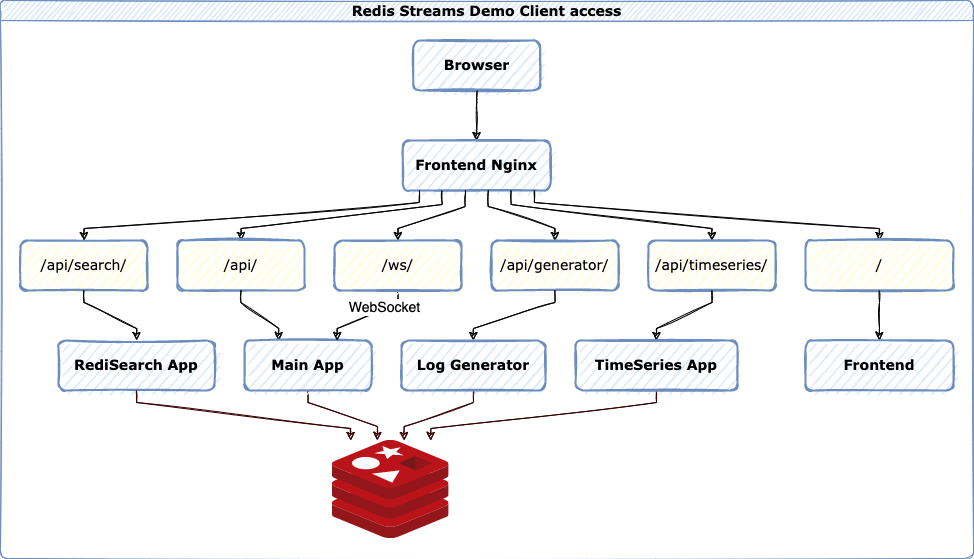

# Redis Log streaming demo

Uses [FastAPI](https://fastapi.tiangolo.com/) for asynchronous web serving. Logging output is done over WebSockets.

Frontend is built on [Quasar](https://quasar.dev/).

Redis modules:
- [RedisJSON 2.0+](https://oss.redis.com/redisjson/)
  - Log generator configuration
  - Log events for indexing and modifying
- [RediSearch 2.2+](https://oss.redislabs.com/redisearch/)
  - Searching logs
  - Geo searching logs
- [RedisTimeSeries](https://oss.redis.com/redistimeseries/)
  - Visualisation of log ingest rate

<br>

# Overview
## Data ingestion


## Client access

# Installation

## Docker
```
docker-compose up
```

## Manually
Requires npm/Quasar environment etc. Just use Docker :)

## Gitpod
You can also spawn the deployment on https://gitpod.io/

https://gitpod.io/#https://github.com/hnsk/redis-streams-log-demo
<br>
<br>

# Components

## Mainapp
Main app for WebSocket connections

## Frontend
Nginx for serving Quasar frontend and proxying to all backend APIs

## Log generator
Service to generate logs based on given configuration. Also offers automated generation.

## Search
Service for RediSearch components

## TimeSeries
Service for TimeSeries components

## Stream splitter
Service for processing "test" stream and split it into stream per severity. Also adds JSON and TimeSeries entries for each event.

## RedisInsight
Service for RedisInsight
<br>
<br>
# Usage

Connect to http://yourhost:8000 and generate some logs.

RedisInsight is also available at http://yourhost:8001

## Stream viewer
- Shows latest 25 log messages from streams.
- Generate messages: generates n messages to stream "test"
- Register stream splitter: Enables stream splitter service to split "test" to streams for each severity and stores the JSON events for RediSearch

## Search logs
- Search: If input is longer than 2 characters, every time the field is updated, it will perform RediSearch query with the input value
- Autocompletion is enabled for some hardcoded keys
- Fields can be modified. Uses RedisJSON in the background, changes are automatically indexed.

## Geo search
- Radius search and aggregates for locations

## Generator
- Allows specifying generator configuration
- RANDINT gets converted to 1..amount
- Some changes require manual Save config to be updated
- Messages are modified directly with RedisJSON commands

## Timeseries
- Visualisation of the timeseries for each log priority ingestion
